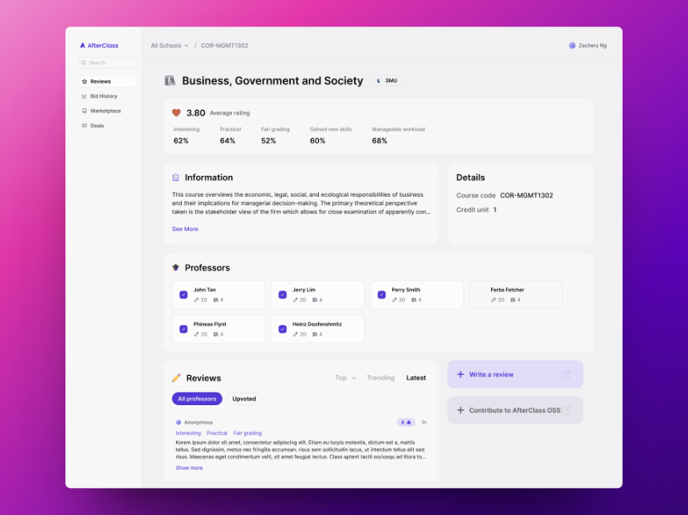

  <h1 align="center">
    
  </h1>

_Explore over 14,000+ reviews of courses and professors. Plan ahead with bid
analytics. Break classroom barriers. The open-source course planning platform
for Singapore Management University (more to come!)_

We’re a committed group of students and alumni working to improve campus life
through technology. AfterClass supports more than 40,000 students each semester
in selecting the ideal modules for their academic path.

 

  

## 🚀 Quick Start

This project is built on top of the [T3
Stack](https://create.t3.gg/en/introduction). With the following core
technologies:

- [TypeScript](https://www.typescriptlang.org/) - Statically typed JavaScript
- [Yarn](https://yarnpkg.com/) - Dependency management

### Frontend

- [Next.js](https://nextjs.org/) - React framework
- [TailwindCSS](https://tailwindcss.com/) - Utility-first CSS framework
- [RadixUI](https://www.radix-ui.com/) & [Shadcn](https://shadcn.com/) -
  Composition-first UI libraries

### Backend

- [Next.js Api Routes](https://nextjs.org/docs/api-routes/introduction) -
  Serverless API endpoints _(used with tRPC)_
- [tRPC](https://trpc.io/) - TypeScript RPC, a framework for building type-safe
  APIs
- [PrismaORM](https://www.prisma.io/) - Modern database access for TypeScript &
  Node.js
- [NextAuth](https://next-auth.js.org/) - Authentication for Next.js
- [Supabase](https://supabase.com/) - The open source Firebase alternative for
  PostgreSQL

### Dev Tools

- [ESLint](https://eslint.org/) - Linting utility for TypeScript and TSX
- [Prettier](https://prettier.io/) - Code formatter
- [Storybook](https://storybook.js.org/) - UI component explorer
- [Docker](https://www.docker.com/) - Containerized development environment

### Development

- [Vercel](https://vercel.com/) - Hosting and deployment
- [Supabase](https://supabase.com/) - Database and authentication

For more information, see the [Development Guide](DEVELOPMENT.md) and
[Deployment Guide](DEPLOYMENT.md).

## 📚 Documentation

- [Project Philosophy](PHILOSOPHY.md)
- [Contributing Guide](CONTRIBUTING.md)
- [Project Architecture](ARCHITECTURE.md)
- [Development Guide](DEVELOPMENT.md)
- [Deployment Guide](DEPLOYMENT.md)

## 🤝 Contributing

See our [contribution guide](CONTRIBUTING.md) for more information

## 📝 License

[MIT](LICENSE)
